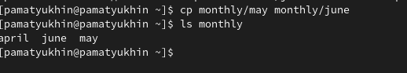
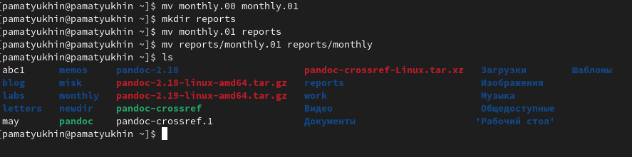
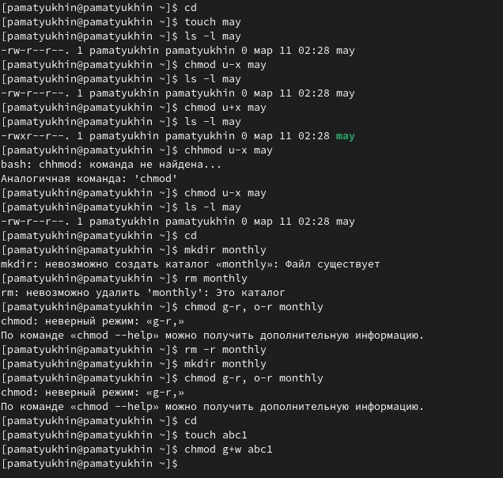

---
## Front matter
lang: ru-RU
title: Лабораторная работа №5
author:
  - Матюхин П.А.
institute:
  - Российский университет дружбы народов, Москва, Россия

## i18n babel
babel-lang: russian
babel-otherlangs: english

## Formatting pdf
toc: false
toc-title: Содержание
slide_level: 2
aspectratio: 169
section-titles: true
theme: metropolis
header-includes:
 - \metroset{progressbar=frametitle,sectionpage=progressbar,numbering=fraction}
 - '\makeatletter'
 - '\beamer@ignorenonframefalse'
 - '\makeatother'
---

# Информация

## Докладчик

:::::::::::::: {.columns align=center}
::: {.column width="70%"}

  * Матюхин Павел Андреевич
  * Студент учебной группы НПИбд-02-22
  * Российский университет дружбы народов
  * <https://github.com/Irgulbic>

:::
::: {.column width="30%"}

:::
::::::::::::::

# Цели и задачи

Ознакомление с файловой системой Linux, её структурой, именами и содержанием
каталогов. Приобретение практических навыков по применению команд для работы
с файлами и каталогами, по управлению процессами (и работами), по проверке исполь-
зования диска и обслуживанию файловой системы.

#Ход работы 

# Изучил команду cp для копирования файлов и каталогов

# Изучил команду mv для перемещения файлов и каталогов

# Изучил систему прав доступа к файлам Линукс

# При помощи команды man узнал информацию про команды mount, fsck, mkfs, kill
mount-С помощью команды mount можно подключить сетевой диск, раздел жесткого диска или USB-накопитель.
fsck-позволяет выполнять проверки согласованности и интерактивное исправление в одной или нескольких файловых системах Linux
mkfs-используется для управления устройствами хранения в Linux.
kill-отвечает за завершение процессов

