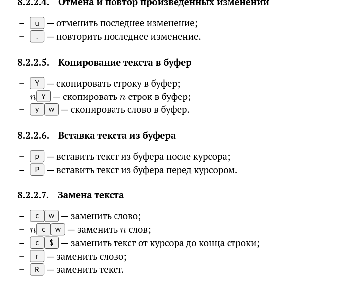
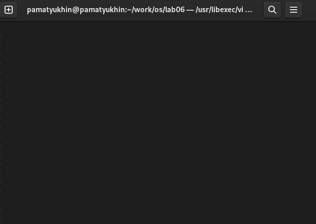

---
## Front matter
lang: ru-RU
title: Лабораторная работа №8
author:
  - Матюхин П.А.
institute:
  - Российский университет дружбы народов, Москва, Россия

## i18n babel
babel-lang: russian
babel-otherlangs: english

## Formatting pdf
toc: false
toc-title: Содержание
slide_level: 2
aspectratio: 169
section-titles: true
theme: metropolis
header-includes:
 - \metroset{progressbar=frametitle,sectionpage=progressbar,numbering=fraction}
 - '\makeatletter'
 - '\beamer@ignorenonframefalse'
 - '\makeatother'
---

# Информация

## Докладчик

:::::::::::::: {.columns align=center}
::: {.column width="70%"}

  * Матюхин Павел Андреевич
  * Студент учебной группы НПИбд-02-22
  * Российский университет дружбы народов
  * <https://github.com/Irgulbic>

:::
::: {.column width="30%"}

:::
::::::::::::::

# Цели и задачи

Познакомиться с операционной системой Linux. Получить практические навыки рабо-
ты с редактором vi, установленным по умолчанию практически во всех дистрибутивах.

#Ход работы 

# Ознакомился с теоретическим материалом.

# Ознакомился с редактором vi.

# Выполнил упражнения, используя команды vi.

# Ответил на контрольные вопросы

#командные символы в редакторе vi
– 0 (ноль) — переход в начало строки;
– $ — переход в конец строки;
– G — переход в конец файла;
– 𝑛 G — переход на строку с номером 𝑛
– Ctrl-d — перейти на пол-экрана вперёд;
– Ctrl-u — перейти на пол-экрана назад;
– Ctrl-f — перейти на страницу вперёд;
– Ctrl-b — перейти на страницу назад.
– W или w — перейти на слово вперёд;
– 𝑛 W или 𝑛 w — перейти на 𝑛 слов вперёд;
– b или B — перейти на слово назад;
– 𝑛 b или 𝑛 B — перейти на 𝑛 слов назад
– а — вставить текст после курсора;
– А — вставить текст в конец строки;
– i — вставить текст перед курсором;
– 𝑛 i — вставить текст 𝑛 раз;
– I — вставить текст в начало строки
– о — вставить строку под курсором;
– О — вставить строку над курсором.
– x — удалить один символ в буфер;
– d w — удалить одно слово в буфер;
– d $ — удалить в буфер текст от курсора до конца строки;
– d 0 — удалить в буфер текст от начала строки до позиции курсора;
– d d — удалить в буфер одну строку;
– 𝑛 d d — удалить в буфер 𝑛 строк.
